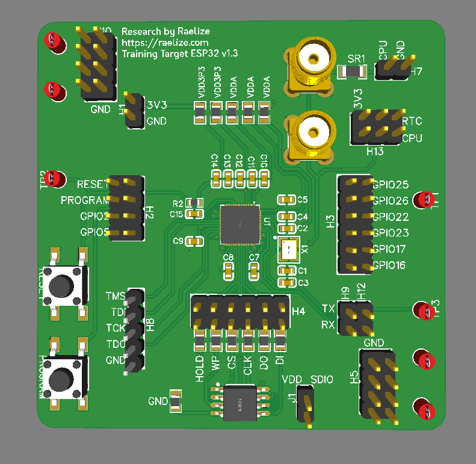

# Raelize Training Target

These are the files we use to make our Training Target for our The Art Of Fault Injection (TAoFI) training.

## Board

## Schematic

## Files

- Gerber Files: `files/Gerber.zip`
- Bill of Materials (BOM): `files/BOM-modified.csv`
- Pick and Place File: `files/PickAndPlace-modified.csv`
